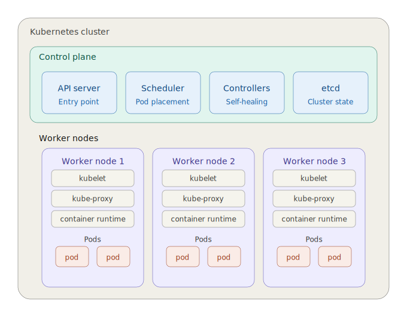

# Kubernetes (K8s)

## Components

- **Worker node**: where the application runs. It can be a physical machine or a virtual machine. Example: EC2 instance, droplet server in digital ocean, etc.
- **Pod**: smallest deployable unit in a worker node, can contain one or more containers (e.g. your app + a log-shipper that reads the app's log file). A container is your packaged app (code + dependencies + minimal OS libs) bundled into an image so it runs the same anywhere.
  - Concrete mapping:  
    - On your laptop with Docker → you run a container.
    - On Kubernetes → you run a Pod that holds that container.
- **Service**: Stable IP/DNS in front of a group of pods. The IP is used by a pod to communicate with other pods. Without a service if a pod dies, a new IP is assigned to the new pod and the other pods will not be able to communicate with it if they are using the old IP. Example: 3 replicas of `api` -> one service `api-svc` for the 3 replicas of `api`. The other pods will communicate with `api-svc` instead of the individual pods. Types of services:
  - ClusterIP: internal only.
  - NodePort: exposes the service on every node's IP at a fixed port (rarely used directly in prod, more of a building block).
  - LoadBalancer: provisions a cloud load balancer (AWS NLB, GCP LB…) with a public IP. This is the typical "external" one.

    Note:  
    NodePort isn't really "internet-facing" the way LoadBalancer is. It's more "reachable from outside the cluster if you know a node's IP."

- **Ingress**: A way to expose a service to the internet using a domain name.

  Note:  
  Why you'd use it over a LoadBalancer Service: one LoadBalancer per service gets expensive fast (each one = a cloud LB = $$). Ingress lets you have one LoadBalancer routing many domains/paths to many services. So: "Smart HTTP router in front of services -> one entry point, many backends."

- **ConfigMap**: It's a source of non-sensitive configuration data. Can be env variables or a file mounted on the pod.
- **Secret**: It's a source of sensitive configuration data. Can be env variables or a file mounted on the pod. By default, the data are stored in base64 encoding, but it's not encrypted. For encryption, you can enable etcd encryption or use a third-party secret management tool, such as HashiCorp Vault, AWS Secrets Manager, etc.
- **Volume**: Storage mounted into a pod. Can be ephemeral (dies with the pod, e.g. emptyDir) or persistent (survives the pod, via PV + PVC).
- **Deployment**: Blueprint for interchangeable pods. Kubernetes can kill any one, create another with a random name, and nothing breaks. It defines the desired configuration of a pod, such as the number of replicas, the image to use, etc. It also manages the lifecycle of the pod, such as scaling up or down, rolling updates, etc. It's used for stateless applications, such as web servers.
- **StatefulSet**: It's like a deployment but each pod has an identity (a fixed name, fixed DNS, and its own dedicated disk that follows it around). It's used for stateful applications, such as databases.

  Note:  
  Deployment treats pods as identical copies. StatefulSet treats pods as named individuals with their own storage.

- **DaemonSet**: It's like a deployment but it's used to run a pod on every worker node. It's used for applications that need to run on every worker node, such as log collectors, monitoring agents, etc.

  Note 1:  
  Deployment = "N copies, anywhere." DaemonSet = "one copy, everywhere."

  Note 2:  
  Mental model: Does this pod need to be tied to a specific node to do its job?  
  Yes (it reads node-local files, kernel events, network interfaces) → DaemonSet.  
  No (it just handles requests) → Deployment.

## Architecture

- **Cluster**: the whole Kubernetes setup, including the control plane and worker nodes. It's the top-level container for all Kubernetes resources. You can have multiple clusters (e.g. staging and prod) and manage them separately. In practice, you either run it yourself (kubeadm, k3s), use a managed service (EKS, GKE, AKS knowing that the provider handles the control plane), or spin up a local one for dev (minikube, kind).
- **Worker node**:
  - Container runtime: Software that actually pulls images and runs containers on the node. Today: containerd (default on EKS, GKE, AKS) or CRI-O (OpenShift). Your Docker images still work as they're standard OCI images, not Docker-specific.
  - Kubelet: An agent that runs on each worker node and communicates with the control plane. It receives the desired state of the cluster from the API server and ensures that the containers are running in the pods as expected. It also reports the status of the pods back to the API server. Concretely, it does four things:
    - **Starts pods**. Watches the API server for "pod X is assigned to my node" → tells the container runtime to pull the image and run the containers.
    - **Keeps them alive**. Runs the health checks you define (liveness/readiness probes). If a container fails its probe, kubelet restarts it. If a container crashes, kubelet restarts it.
    - **Reports status upward**. Continuously tells the API server: "pod X is running, pod Y is crash-looping, my node has 4 GB free." This is how kubectl get pods knows anything.
    - **Mounts what the pod needs**. Attaches volumes, injects ConfigMaps/Secrets as files or env vars, sets up the pod's filesystem before the container starts.
  - Kube-proxy: Routes requests from a Service IP to one of its backing pod IPs (load-balanced across them).
- **Control plane**:
  - **API server**: The entrypoint for all requests to the cluster. Can be operated through CLI, UI, client, API, etc. It validates and processes the requests and updates the state of the cluster accordingly.
  - **Scheduler**: Responsible for assigning pods to worker nodes based on resource availability and other constraints. Example: a new pod needs 2 CPU + 4 GB RAM, with a GPU. Scheduler looks at all worker nodes, filters out the ones without a GPU or enough free resources, scores the rest, and picks the best.
  - **Controller manager**: Runs a bunch of controllers that ensure the desired state of the cluster is maintained.
  
    Examples:  
    - Deployment controller: "Spec says 3 replicas, I see 2 → create one more."
    - Node controller: "This node hasn't reported in 5 min → mark it NotReady, evict its pods."

  - **etcd**: A distributed key-value store holding the entire state of the cluster (every pod, service, configmap, secret, node status, etc.). The cluster's brain. It does NOT store logs, metrics, or application data. Only cluster state. It's the only stateful component in the control plane; everything else (API server, scheduler, controllers) is stateless and just reads/writes etcd. Lose etcd → lose your cluster, so etcd backups = cluster backups.

### Illustration

Trace of `kubectl apply -f deployment.yaml` on the diagram:

1. Hits the **API server** (blue, top-left).
2. **API server** writes the desired state to **etcd**.
3. **Controllers** notice "3 replicas wanted, 0 exist" → create 3 Pod objects in **etcd**.
4. **Scheduler** sees 3 unscheduled pods → assigns each to a **worker node**.
5. The **kubelet** on each chosen node sees its assignment → asks the **container runtime** to pull the image and start the container.
6. The **pod** (coral box) now exists inside that **worker node**.
7. **kube-proxy** wires up Service networking so other pods can reach it.
